# Execution Plan

## Detailed Analysis Summary
- Risk Level: Medium-High
- Change Impact:
  - User-facing changes: Yes
  - Structural changes: Yes (full greenfield stack)
  - Data model changes: Yes
  - API changes: Yes
  - NFR impact: Yes (auth/session/SSE/performance)

## Workflow Visualization

```mermaid
flowchart TD
    Start([Start]) --> WD[Workspace Detection - COMPLETED]
    WD --> RA[Requirements Analysis - COMPLETED]
    RA --> US[User Stories - COMPLETED]
    US --> WP[Workflow Planning - COMPLETED]
    WP --> AD[Application Design - EXECUTE]
    AD --> UG[Units Generation - EXECUTE]
    UG --> FD[Functional Design - EXECUTE]
    FD --> NFRA[NFR Requirements - EXECUTE]
    NFRA --> NFRD[NFR Design - EXECUTE]
    NFRD --> ID[Infrastructure Design - EXECUTE]
    ID --> CG[Code Generation - EXECUTE]
    CG --> BT[Build and Test - EXECUTE]
    BT --> End([Complete])

    style WD fill:#4CAF50,stroke:#1B5E20,stroke-width:3px,color:#fff
    style RA fill:#4CAF50,stroke:#1B5E20,stroke-width:3px,color:#fff
    style US fill:#4CAF50,stroke:#1B5E20,stroke-width:3px,color:#fff
    style WP fill:#4CAF50,stroke:#1B5E20,stroke-width:3px,color:#fff
    style AD fill:#FFA726,stroke:#E65100,stroke-width:3px,stroke-dasharray: 5 5,color:#000
    style UG fill:#FFA726,stroke:#E65100,stroke-width:3px,stroke-dasharray: 5 5,color:#000
    style FD fill:#FFA726,stroke:#E65100,stroke-width:3px,stroke-dasharray: 5 5,color:#000
    style NFRA fill:#FFA726,stroke:#E65100,stroke-width:3px,stroke-dasharray: 5 5,color:#000
    style NFRD fill:#FFA726,stroke:#E65100,stroke-width:3px,stroke-dasharray: 5 5,color:#000
    style ID fill:#FFA726,stroke:#E65100,stroke-width:3px,stroke-dasharray: 5 5,color:#000
    style CG fill:#4CAF50,stroke:#1B5E20,stroke-width:3px,color:#fff
    style BT fill:#4CAF50,stroke:#1B5E20,stroke-width:3px,color:#fff
    style Start fill:#CE93D8,stroke:#6A1B9A,stroke-width:3px,color:#000
    style End fill:#CE93D8,stroke:#6A1B9A,stroke-width:3px,color:#000
```

## Text Alternative
1. Workspace Detection 완료
2. Requirements Analysis 완료
3. User Stories 완료
4. Workflow Planning 완료
5. Application Design 실행
6. Units Generation 실행
7. Functional Design 실행
8. NFR Requirements 실행
9. NFR Design 실행
10. Infrastructure Design 실행
11. Code Generation 실행
12. Build and Test 실행

## Phases to Execute

### INCEPTION
- [x] Workspace Detection
- [x] Reverse Engineering - SKIP
- [x] Requirements Analysis
- [x] User Stories
- [x] Workflow Planning
- [x] Application Design - EXECUTE
- [x] Units Generation - EXECUTE

### CONSTRUCTION
- [x] Functional Design - EXECUTE
- [x] NFR Requirements - EXECUTE
- [x] NFR Design - EXECUTE
- [x] Infrastructure Design - EXECUTE
- [x] Code Generation - EXECUTE
- [x] Build and Test - EXECUTE

### OPERATIONS
- [ ] Operations - PLACEHOLDER

## Estimated Timeline
- Total: 1 working iteration (design docs + MVP code + test)

## Success Criteria
- customer/admin MVP 기능 동작
- 실시간 주문 모니터링(SSE) 동작
- 자동화 테스트 통과
- build-and-test 문서 생성
